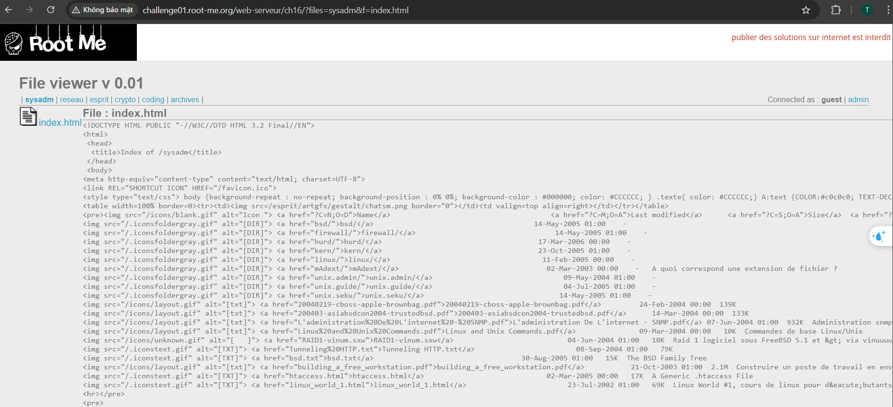

# File Inclusion

# 1. Tổng quan

File Inclusion là một loại lỗ hổng cho phép kẻ tấn công truy cập, đọc nội dung hoặc thậm chí thực thi mã từ xa trên server. Chia thành hai dạng chính:

- **Local File Inclusion (LFI):** Include các tệp cục bộ trên server.
- **Remote File Inclusion (RFI):** Include các tệp từ server khác.

## Ảnh Hưởng:

- Đọc file tùy ý.
- RCE.

## Root Cause

- **User input không được lọc/khiểm tra kỹ:** Ứng dụng nhận tham số từ user và truyền thẳng vào hàm nguy hiểm như `include()`, `require()`, `file_get_contents()`.
- **Cấu hình PHP không an toàn:** Nếu `allow_url_include = On`, hacker có thể include file từ server khác (RFI).

# 2. LAB

## **FI-01: Local File Inclusion**

[link](https://www.root-me.org/en/Challenges/Web-Server/Local-File-Inclusion)

Get in the admin section.

Ta thấy trên URL có 2 tham số là `files` ( folder ) và `f`(tên file cụ thể )

Nếu nhập : `?files=sysadm&f=index.html` thì path sẽ thành `/var/www/html/ch16/sysadm/index.html`

Bên góc phải cho thấy hiện tại đang kết nối với tư cách là guest, ngoài ra còn có thể kết nối là admin

Thử log sai và biết được path của admin

`http://challenge01.root-me.org/web-serveur/ch16/?files=sysadm&f=index.html`

Từ path hiện tại ⇒ muốn truy cập folder admin thì phải lùi 1 thư mục ( nếu dùng tham số `files` ) hoặc 2 (nếu dùng tham số `f`)

Payload: 

1. `http://challenge01.root-me.org/web-serveur/ch16/?files=../admin&f=index.php` 
2. `http://challenge01.root-me.org/web-serveur/ch16/?files=sysadm&f=../../admin/index.php`

## FI-02: **Local File Inclusion - Double encoding**

[link](https://www.root-me.org/en/Challenges/Web-Server/Local-File-Inclusion-Double-encoding)

Find the validation password in the source files of the website.

Test các chức năng ta thấy được trang web này điều hướng nội dung giữa các trang bằng tham số `page` ⇒ Dấu hiệu File Inclusion

Thử dùng `../` để quay về thư mục gốc đọc file nhưng không thành công

Encode 2 lần thì không thấy lỗi nữa

Tham số page khi truyền vào chỉ có ../../ nhưng từ lỗi ta thấy thêm .inc.php

Thử đọc file `home.inc.php`

`php://filter/convert.base64-encode/resource=home`   ( encode 2 lần )

Tìm được file `conf.inc.php`

## FI-03: **Remote File Inclusion**

[link](https://www.root-me.org/en/Challenges/Web-Server/Remote-File-Inclusion)

Get the PHP source code.

Bất cứ thứ gì ta nhập vào đều sẽ thêm `_lang.php` 

Pypass bằng dấu `?` 
Trong PHP, dấu `?` không ảnh hưởng đến đường dẫn file
VD:      `include("../../../../etc/passwd?_lang.php")`
Nếu file `../../../../etc/passwd` tồn tại, PHP sẽ bỏ qua phần `_lang.php` vì dấu `?` làm cho `_lang.php` trở thành một **query string**, mà query string thì không ảnh hưởng đến file.

Thử truy cập vào nội bộ nhưng không có gì hot

Tạo 1 đoạn mã khai thác rồi up lên gist sau đó gửi đi

View Page Source để lấy flag

## FI-04: **PHP - Filters**

[link](https://www.root-me.org/en/Challenges/Web-Server/PHP-Filters)

Retrieve the administrator password of this application.

Bài này cũng không có gì dùng `php://filter` đọc file config

