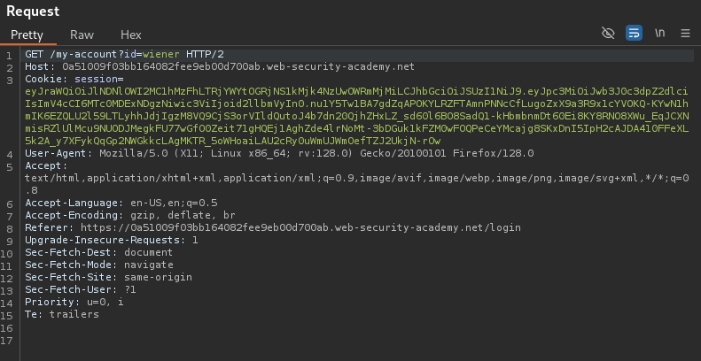

# JWT ATTACKS

# I. Tổng quan

**JSON Web Token** (JWT) là một cách phổ biến để xác thực và truyền thông tin giữa các bên một cách an toàn. Tuy nhiên, nếu không được cấu hình đúng cách, JWT có thể dễ bị tấn công, dẫn đến lỗ hổng bảo mật nghiêm trọng.

Trong bài viết này, chúng ta sẽ thực hành và phân tích các kỹ thuật tấn công JWT trên nền tảng PortSwigger.

# **II**. Các kĩ thuật khai thác JWT

## 1. JWT-01: **JWT authentication bypass via unverified signature**

[lab-jwt-authentication-bypass-via-unverified-signature](https://portswigger.net/web-security/jwt/lab-jwt-authentication-bypass-via-unverified-signature)

### **Description and Impact**

Lỗ hổng này xảy ra khi server bỏ qua hoặc xử lý không đúng cách việc xác minh signature của JWT. Điều này cho phép kẻ tấn công chỉnh sửa nội dung JWT tùy ý mà không cần đến khóa bí mật hợp lệ. Nếu khai thác thành công, attacker có thể bypass xác thực, giả mạo người dùng có quyền cao hơn (như admin) và truy cập trái phép vào hệ thống.

### **Root Cause**

Server không xác minh **signature** của JWT, cho phép hacker chỉnh sửa token mà không cần khóa bí mật hợp lệ.

### **Reproduce**

Đăng nhập vào tài khoản bình thường và truy cập `GET /my-account`, lấy JWT từ **session cookie**:

Dùng Burp Suite Extensions (JSON Web Tokens) hoặc [jwt.io](https://jwt.io/) để giải mã JWT, quan sát phần **payload** chứa `"sub": "wiener"` 

Gửi request  `GET /admin`, thấy rằng truy cập bị từ chối do không phải admin.

Chỉnh sửa payload của JWT, thay đổi `sub` thành `"administrator"`, sau đó gửi lại  request với JWT đã chỉnh sửa

Quan sát respone, thấy rằng có thể truy cập thành công vào Admin panel.

## **2. JWT-02: JWT authentication bypass via flawed signature verification**

[lab-jwt-authentication-bypass-via-flawed-signature-verification](https://portswigger.net/web-security/jwt/lab-jwt-authentication-bypass-via-flawed-signature-verification)

### **Description and Impact**

Lỗ hổng này xảy ra khi server chấp nhận JWT có thuật toán "none", cho phép attacker tạo JWT hợp lệ mà không cần signature. Điều này dẫn đến bypass xác thực và truy cập trái phép vào tài khoản admin.

### **Root Cause**

Server chấp nhận JWT với `alg: "none"` mà không xác minh tính hợp lệ.

### **Reproduce**

Đầu tiên, ta thử chỉnh sửa payload (`"sub": "administrator"`) giống như cách khai thác trong JWT-01, nhưng lần này server vẫn từ chối truy cập vào Admin panel.

**Lý do?**

- Không giống như JWT-01, server trong lab này có kiểm tra signature JWT.
- Nếu chỉ sửa payload mà không có signature hợp lệ, server sẽ phát hiện JWT đã bị chỉnh sửa và từ chối nó.

Vì server **tin tưởng** giá trị `alg` trong header của JWT, ta có thể đánh lừa nó để bỏ qua kiểm tra signature bằng cách thay đổi thuật toán thành `"none"` và xóa đi phần signature ( không xóa dấu `.` cuối cùng để server có thể nhận diện jwt)

Gửi lại request, truy cập vào Admin panel thành công

## 3. JWT-03: **JWT authentication bypass via weak signing key**

[lab-jwt-authentication-bypass-via-weak-signing-key](https://portswigger.net/web-security/jwt/lab-jwt-authentication-bypass-via-weak-signing-key)

### **Description and Impact**

Lỗ hổng này xảy ra khi server sử dụng một **khóa bí mật yếu (weak signing key)** để ký JWT. Nếu attacker brute-force được khóa này, họ có thể tự tạo JWT hợp lệ để giả mạo bất kỳ người dùng nào, bao gồm cả admin.

### **Root Cause**

Server sử dụng một khóa ký quá yếu hoặc phổ biến, có thể dễ dàng brute-force bằng từ điển các khóa phổ biến.

### **Reproduce**

Lúc này, server vừa xác thực signature, vừa không chấp nhận `"alg": "none`", nên ta cần tìm secret key để có thể ký lại JWT.
Dùng hashcat để brute-force secret-key:

`hashcat -a 0 -m 16500 <YOUR-JWT> /path/to/jwt.secrets.list`

Với **secret key** đã tìm được, ta có thể tạo lại signature hợp lệ cho JWT, vượt qua cơ chế xác thực của server và thành công vào được Admin panel

Các cách để tạo signature:

- [Tạo bằng jwt.io](https://www.youtube.com/watch?v=N31d0vEaXyg)
- [Tạo bằng Burp Extension](https://www.youtube.com/watch?v=Wu6UR-Myiy0)

## 4. JWT-04: **JWT authentication bypass via jwk header injection**

[lab-jwt-authentication-bypass-via-jwk-header-injection](https://portswigger.net/web-security/jwt/lab-jwt-authentication-bypass-via-jwk-header-injection)

### **Description and Impact**

Lỗ hổng này xảy ra khi server không xác thực danh sách khóa tin cậy và cho phép nhúng khóa công khai vào JWT thông qua tham số `jwk` trong header. Attacker có thể lợi dụng điểm này để tự tạo JWT hợp lệ mà không cần khóa riêng của server, từ đó bypass cơ chế xác thực và chiếm quyền admin.

### **Root Cause**

Server tin tưởng khóa công khai nhúng trong JWT mà không kiểm tra nguồn gốc.

### **Reproduce**

Vào Extension **JWT Editor**, tạo **RSA Key** mới ( **JWT Editor** → **New RSA Key** → **Generate** → **OK)**

Sau đó nhúng **RSA Key** vừa tạo

Vào **Burp Repeater**, chọn request có JWT mà ta bắt được, qua tab JSON Web Token, sửa `"sub":administrator"` , sau đó chọn **Attack → Embedded JWK**.

Gửi request `GET /admin`  cùng với cookie session đã sửa, thành công truy cập vào Admin Panel

Link tham khảo: [https://www.youtube.com/watch?v=Y94VBDvUxlc](https://www.youtube.com/watch?v=Y94VBDvUxlc)

## 5. JWT-05: **JWT authentication bypass via jku header injection**

[lab-jwt-authentication-bypass-via-jku-header-injection](https://portswigger.net/web-security/jwt/lab-jwt-authentication-bypass-via-jku-header-injection)

### **Description and Impact**

Lỗ hổng này xảy ra khi server chấp nhận URL từ tham số `jku` trong JWT header mà không kiểm tra tính hợp lệ của nguồn. Attacker có thể lợi dụng điều này để chỉ định một JWK Set giả mạo, giúp tạo JWT hợp lệ mà không cần biết secret key của server.
Nói cách khác, attacker đánh lừa server bằng cách chỉ cho nó một "ổ khóa" giả, rồi dùng "chìa khóa" của chính mình để mở.

### **Root Cause**

- Server tin tưởng giá trị `jku` và tải JWK Set từ nguồn không xác thực.
- Không giới hạn domain hợp lệ, cho phép hacker cung cấp JWK giả mạo.
- Chấp nhận khóa từ JWK Set mà không kiểm tra tính hợp lệ, dẫn đến bypass xác thực JWT.

### **Reproduce**

Tạo RSA Key ( như ở JWT-04), sau đó truy cập Exploit Server, thay body bằng:

**Copy** **Public Key as JWK** từ RSA Key , dán vào `"key":[]` rồi lưu lại.

Vào **Burp Repeater**, chuyển sang tab **JSON Web Token**.

Sửa `kid` thành `kid` của JWK đã upload.

Thêm  param`jku` trỏ đến JWK Set trên exploit server.

Sửa `sub` thành `administrator`.

Nhấn **Sign** → Chọn RSA key đã tạo → **OK**.

Gửi request tới `/admin` bằng JWT mới, thành công truy cập được Admin panel

Link tham khảo: [https://www.youtube.com/watch?v=nKspdXGrZhI](https://www.youtube.com/watch?v=nKspdXGrZhI)

## 6. JWT-06: **JWT authentication bypass via kid header path traversal**

[lab-jwt-authentication-bypass-via-kid-header-path-traversal](https://portswigger.net/web-security/jwt/lab-jwt-authentication-bypass-via-kid-header-path-traversal)

### **Description and Impact**

Lỗ hổng này xảy ra khi server sử dụng tham số `kid` trong header của JWT để xác định secret key mà không kiểm tra hoặc giới hạn giá trị hợp lệ. Điều này cho phép kẻ tấn công lợi dụng path traversal để trỏ `kid` đến các tệp tùy ý trên hệ thống, trong đó có `/dev/null` (tệp rỗng trên Linux). Khi máy chủ đọc secret key từ `/dev/null`, giá trị trả về sẽ là một chuỗi rỗng (`""`), dẫn đến việc kẻ tấn công có thể ký lại JWT hợp lệ bằng secret key rỗng và bypass xác thực.

### **Root Cause**

- Máy chủ **không kiểm tra hoặc xác thực giá trị của tham số `kid`** mà trực tiếp sử dụng nó để xác định khóa ký.
- Cho phép **path traversal (`../../`)** trong `kid`, dẫn đến việc máy chủ có thể lấy nội dung của bất kỳ tệp nào trên hệ thống.

### **Reproduce**

Vào tab **JWT Editor Keys**, tạo **Symmetric Key** mới, hay giá trị `k` bằng **Base64-encoded null byte** (`AA==`)

Vào **Burp Repeater**, chuyển sang tab **JSON Web Token**.

Sửa `sub` thành `administrator` , `kid` thành:

Nhấn **Sign** → Chọn key đã tạo → **OK**.

Gửi request tới `/admin` bằng JWT mới, thành công truy cập được Admin panel

## 7. JWT-07: **JWT authentication bypass via algorithm confusion**

[lab-jwt-authentication-bypass-via-algorithm-confusion](https://portswigger.net/web-security/jwt/algorithm-confusion/lab-jwt-authentication-bypass-via-algorithm-confusion)

### **Description and Impact**

Lỗ hổng này xảy ra khi server JWT hỗ trợ nhiều thuật toán xác thực nhưng không kiểm soát chặt chẽ cách sử dụng chúng. Kẻ tấn công có thể thay đổi thuật toán ký từ bất đối xứng sang đối xứng, dẫn đến việc sử dụng sai khóa xác thực. Nếu máy chủ vô tình **dùng khóa công khai làm khóa bí mật**, kẻ tấn công có thể tự tạo JWT hợp lệ mà không cần biết secret key thực sự. Điều này có thể dẫn đến bypass xác thực và truy cập trái phép vào hệ thống.

### **Root Cause**

- Máy chủ không giới hạn thuật toán để ký JWT.
- Sử dụng khóa công khai như khóa bí mật khi xác minh HS256.

### **Reproduce**

Lấy khóa công khai của server từ endpoint `/jwks.json`.

Vào **JWT Editor** → **New RSA Key** → Paste key → OK.

Nhấn chuột phải vào key vừa tạo → **Copy Public Key as PEM**.

Dùng **Decoder** Base64 encode PEM, copy kết quả.

Vào lại **JWT Editor** → **New Symmetric Key** → **Generate**.

Thay giá trị **k** bằng chuỗi Base64-encoded PEM vừa tạo → **OK**.

Vào **Burp Repeater** để sửa JWT, đổi `"alg":"HS256"` , `"sub":"administrator"` , sau đó **Sign** lại bằng **Symmetric Key** vừa tạo

Gửi request `GET /admin` với JWT mới và thành công truy cập Admin panel

---

---

---

---

---

---